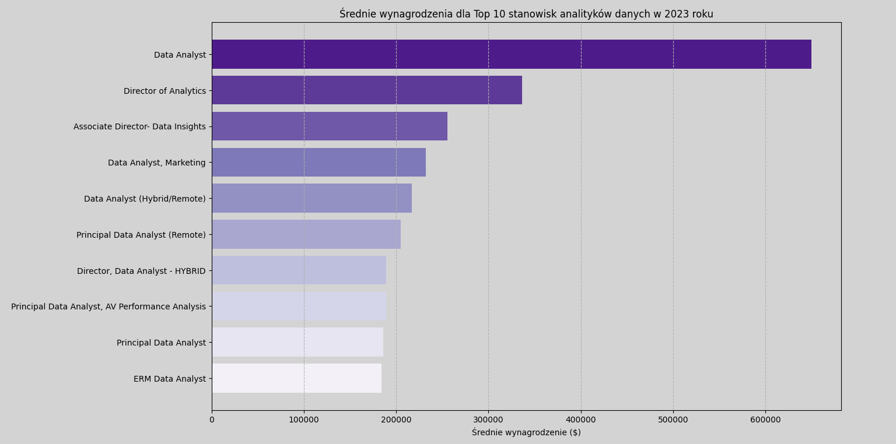
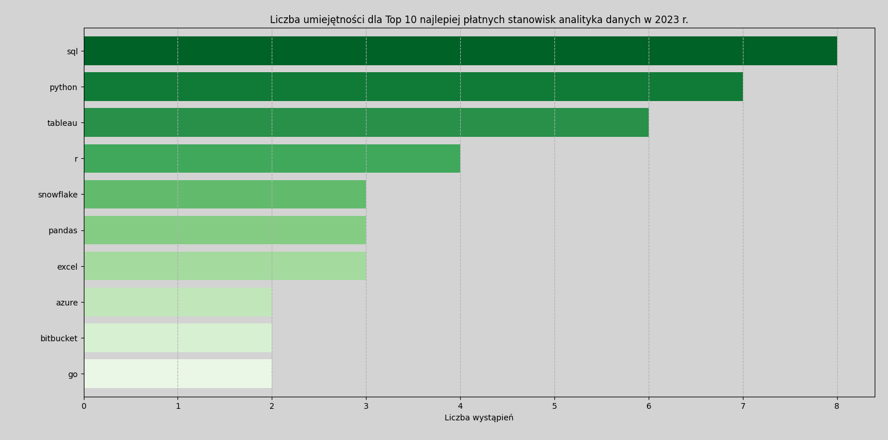
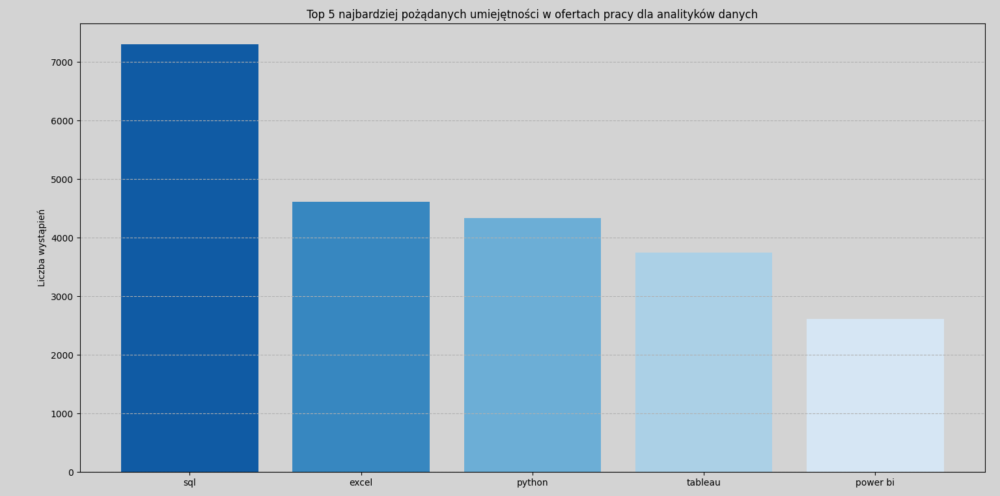
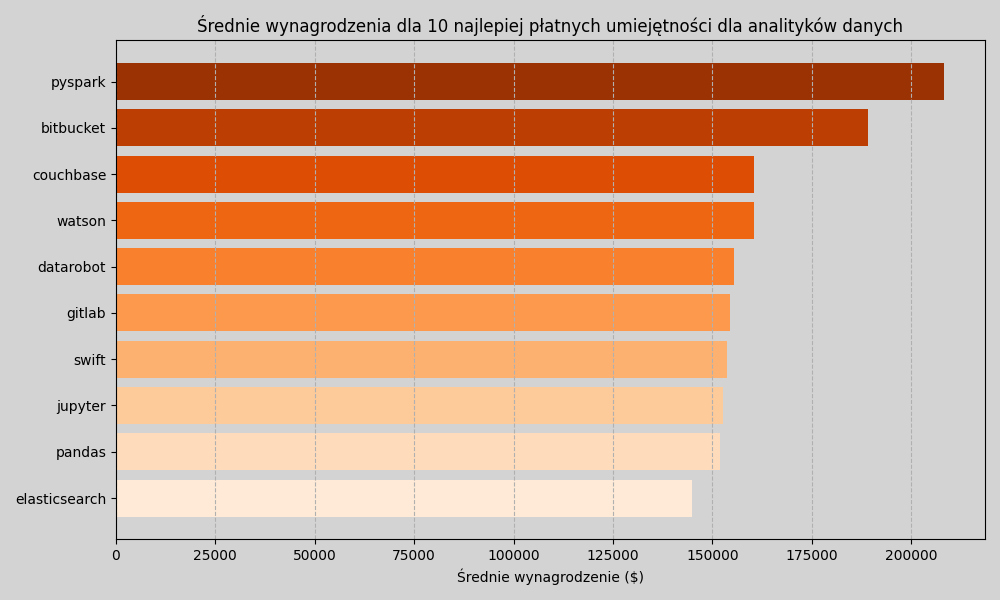

# Wprowadzenie
📊 Ten projekt oferuje kompleksową analizę rynku pracy w obszarze analizy danych. Koncentrując się na rolach analityków danych, projekt bada najlepiej płatne stanowiska, najbardziej pożądane umiejętności oraz miejsca, gdzie wysoki popyt łączy się z atrakcyjnymi wynagrodzeniami w branży analityki danych.📈


# Podstawowe informacje
Kierując się dążeniem do skuteczniejszego poruszania się po rynku pracy analityków danych, projekt ten narodził się z chęci wskazania najlepiej płatnych i poszukiwanych umiejętności, usprawniając pracę innych w celu znalezienia optymalnych miejsc pracy.

Dane pochodzą ze strony [kaggle.com](https://www.kaggle.com/) . Są one pełne informacji na temat tytułów stanowisk, wynagrodzeń, lokalizacji i niezbędnych umiejętności.

### Pytania, na które chciałam odpowiedzieć za pomocą zapytań SQL to:
1. Jakie są najlepiej płatne stanowiska analityka danych?
2. Jakie umiejętności są wymagane na tych najlepiej płatnych stanowiskach?
3. Jakie umiejętności są najbardziej pożądane u analityków danych?
4. Które umiejętności wiążą się z wyższymi wynagrodzeniami?
5. Jakie są najbardziej optymalne umiejętności do opanowania?


# Narzędzia, których użyłam
W celu dogłębnego zbadania rynku pracy dla analityków danych, wykorzystałam moc kilku kluczowych narzędzi:

- **SQL:** Trzon mojej analizy, pozwalający mi na przeszukiwanie bazy danych i odkrywanie krytycznych spostrzeżeń.
- **PostgreSQL:** Wybrany system zarządzania bazą danych, idealny do obsługi danych z ofert pracy.
- **Visual Studio Code:** Moje narzędzie do zarządzania bazą danych i wykonywania zapytań SQL.
- **Python:** Używany do tworzenia wykresów i wizualizacji, umożliwiających lepsze zrozumienie i prezentację danych.
- **Git i GitHub:** Niezbędne do kontroli wersji i udostępniania moich skryptów SQL i analiz, zapewniając współpracę i śledzenie projektu.


# Analiza
 Każde zapytanie w ramach tego projektu miało na celu zbadanie konkretnych aspektów rynku pracy dla analityków danych. Oto jak podeszłam do każdego pytania:

 ### 1. Najlepiej płatne stanowiska analityka danych
 Aby zidentyfikować najlepiej płatne role, przefiltrowałam stanowiska analityków danych według średniego rocznego wynagrodzenia i lokalizacji, koncentrując się na ofertach pracy zdalnej. To zapytanie podkreśla najlepiej płatne możliwości w tej dziedzinie.

``` sql
 SELECT
    job_id,
    job_title,
    job_location,
    job_schedule_type,
    salary_year_avg,
    job_posted_date,
    name AS company_name
FROM
    job_postings_fact
LEFT JOIN company_dim ON job_postings_fact.company_id = company_dim.company_id
WHERE
    job_title_short = 'Data Analyst' AND
    job_location = 'Anywhere' AND
    salary_year_avg IS NOT NULL
ORDER BY
    salary_year_avg DESC
LIMIT 10
```

Oto zestawienie najlepszych stanowisk analityka danych w 2023 roku:
- **Szeroki zakres wynagrodzeń:** 10 najlepiej płatnych ról analityków danych waha się od 184 000 USD do 650 000 USD, co wskazuje na znaczny potencjał płacowy w tej dziedzinie.
- **Zróżnicowani pracodawcy:** Firmy takie jak SmartAsset, Meta i AT&T są jednymi z tych, które oferują wysokie wynagrodzenia, co wskazuje na szerokie zainteresowanie w różnych branżach.
- **Różnorodność tytułów stanowisk:** Istnieje duża różnorodność tytułów stanowisk, od analityka danych po dyrektora ds. analityki, co odzwierciedla różne role i specjalizacje w analityce danych.



*Wykres słupkowy wizualizujący wynagrodzenie dla 10 najlepiej opłacanych stanowisk analityków danych; wykres wygenerowany w języku python na podstawie wyników zapytania SQL*.

### 2. Umiejętności na najlepiej płatnych stanowiskach
Aby zrozumieć, jakie umiejętności są wymagane na najlepiej płatnych stanowiskach, połączyłam oferty pracy z danymi dotyczącymi umiejętności, zapewniając wgląd w to, co pracodawcy cenią na stanowiskach wymagających wysokich wynagrodzeń.

```sql
WITH top_paying_jobs AS (
    SELECT	
        job_id,
        job_title,
        salary_year_avg,
        name AS company_name
    FROM
        job_postings_fact
    LEFT JOIN company_dim ON job_postings_fact.company_id = company_dim.company_id
    WHERE
        job_title_short = 'Data Analyst' AND 
        job_location = 'Anywhere' AND 
        salary_year_avg IS NOT NULL
    ORDER BY
        salary_year_avg DESC
    LIMIT 10
)

SELECT 
    top_paying_jobs.*,
    skills
FROM top_paying_jobs
INNER JOIN skills_job_dim ON top_paying_jobs.job_id = skills_job_dim.job_id
INNER JOIN skills_dim ON skills_job_dim.skill_id = skills_dim.skill_id
ORDER BY
    salary_year_avg DESC;
```

Oto zestawienie najbardziej pożądanych umiejętności dla 10 najlepiej płatnych stanowisk analityka danych w 2023 roku:
- **SQL** jest liderem, 8 na 10 stanowisk wymaga znajomości SQL.
- **Python** plasuje się tuż za nim, 7/10 stanowisk.
- **Tableau** jest również bardzo poszukiwane, 6/10 stanowisk.
Inne umiejętności, takie jak **R**, **Snowflake**, **Pandas** i **Excel** wykazują różny stopień popytu.



*Wykres słupkowy wizualizujący liczbę umiejętności dla 10 najlepiej płatnych zawodów dla analityków danych; wykres wygenerowany w języku python na podstawie wyników zapytania SQL*.

### 3. Najbardziej pożądane umiejętności analityków danych

To zapytanie pomogło zidentyfikować umiejętności najczęściej wymagane w ofertach pracy, kierując uwagę na obszary o wysokim popycie.

```sql
SELECT 
  skills,
  COUNT(skills_job_dim.job_id) AS demand_count
FROM job_postings_fact
INNER JOIN skills_job_dim ON job_postings_fact.job_id = skills_job_dim.job_id
INNER JOIN skills_dim ON skills_job_dim.skill_id = skills_dim.skill_id
WHERE
  job_title_short = 'Data Analyst' AND
  job_work_from_home = TRUE
GROUP BY
  skills
ORDER BY
  demand_count DESC
LIMIT 5
```

Oto zestawienie najbardziej poszukiwanych umiejętności dla analityków danych w 2023 roku
- **SQL** i **Excel** pozostają fundamentalne, podkreślając potrzebę posiadania silnych umiejętności podstawowych w zakresie przetwarzania danych i manipulacji arkuszami kalkulacyjnymi.
- Narzędzia do **programowania** i **wizualizacji**, takie jak **Python**, **Tableau** i **Power BI** są niezbędne, wskazując na rosnące znaczenie umiejętności technicznych. 


*Wykres słupkowy umiejętności najczęściej wymaganych w ofertach pracy dla analityków danych; wykres wygenerowany w języku python na podstawie wyników zapytania SQL*.

| Skills   | Demand Count |
|----------|--------------|
| SQL      | 7291         |
| Excel    | 4611         |
| Python   | 4330         |
| Tableau  | 3745         |
| Power BI | 2609         |
*Tabela zapotrzebowania na 5 najważniejszych umiejętności w ogłoszeniach o pracę analityka danych*

### 4. Umiejętności na podstawie wynagrodzenia
Zbadanie średnich wynagrodzeń związanych z różnymi umiejętnościami ujawniło, które umiejętności są najlepiej płatne.

```sql
SELECT 
  skills,
  ROUND(AVG(salary_year_avg), 0) AS avg_salary
FROM job_postings_fact
INNER JOIN skills_job_dim ON job_postings_fact.job_id = skills_job_dim.job_id
INNER JOIN skills_dim ON skills_job_dim.skill_id = skills_dim.skill_id
WHERE
  job_title_short = 'Data Analyst' 
  AND salary_year_avg IS NOT NULL
  AND job_work_from_home = TRUE
GROUP BY
  skills
ORDER BY
    avg_salary DESC
LIMIT 25
```

Oto zestawienie wyników dla najlepiej płatnych umiejętności dla analityków danych:
- **Wysokie zapotrzebowanie na umiejętności Big Data i ML:** Najwyższe wynagrodzenia otrzymują analitycy posiadający umiejętności w zakresie technologii Big Data (PySpark, Couchbase), narzędzi uczenia maszynowego (DataRobot, Jupyter) i bibliotek Python (Pandas, NumPy), co odzwierciedla wysoką wycenę przetwarzania danych i możliwości modelowania predykcyjnego w branży.
- **Biegłość w tworzeniu i wdrażaniu oprogramowania:** Znajomość narzędzi programistycznych i wdrożeniowych (GitLab, Kubernetes, Airflow) wskazuje na lukratywne skrzyżowanie analizy danych i inżynierii, z naciskiem na umiejętności ułatwiające automatyzację i wydajne zarządzanie potokiem danych.
- **Doświadczenie w przetwarzaniu w chmurze:** Znajomość chmury obliczeniowej i narzędzi inżynierii danych (Elasticsearch, Databricks, GCP) podkreśla rosnące znaczenie środowisk analitycznych opartych na chmurze, sugerując, że biegłość w chmurze znacznie zwiększa potencjał zarobkowy w analityce danych.


*Wykres słupkowy najlepiej płatnych umiejętności w ofertach pracy dla analityków danych; wykres wygenerowany w języku python na podstawie wyników zapytania SQL*.

| Skills        | Average Salary ($) |
|---------------|-------------------:|
| pyspark       |            208,172 |
| bitbucket     |            189,155 |
| couchbase     |            160,515 |
| watson        |            160,515 |
| datarobot     |            155,486 |
| gitlab        |            154,500 |
| swift         |            153,750 |
| jupyter       |            152,777 |
| pandas        |            151,821 |
| elasticsearch |            145,000 |

*Tabela średniego wynagrodzenia dla 10 najlepiej płatnych umiejętności analityków danych*

### 5. Najbardziej optymalne umiejętności do opanowania

Łącząc spostrzeżenia z danych dotyczących popytu i wynagrodzeń, to zapytanie miało na celu wskazanie umiejętności, na które jest zarówno duże zapotrzebowanie, jak i wysokie wynagrodzenia, oferując strategiczne ukierunkowanie na rozwój umiejętności.

```sql
SELECT 
    skills_dim.skill_id,
    skills_dim.skills,
    COUNT(skills_job_dim.job_id) AS demand_count,
    ROUND(AVG(job_postings_fact.salary_year_avg), 0) AS avg_salary
FROM job_postings_fact
INNER JOIN skills_job_dim ON job_postings_fact.job_id = skills_job_dim.job_id
INNER JOIN skills_dim ON skills_job_dim.skill_id = skills_dim.skill_id
WHERE
    job_title_short = 'Data Analyst'
    AND salary_year_avg IS NOT NULL
    AND job_work_from_home = True 
GROUP BY
    skills_dim.skill_id
HAVING
    COUNT(skills_job_dim.job_id) > 10
ORDER BY
    avg_salary DESC,
    demand_count DESC
LIMIT 25;
```

*Wykres punktowy prezentujący zależność między liczbą wystąpień a średnim wynagrodzeniem dla umiejętności dla analityków danych; wykres wygenerowany w języku python na podstawie wyników zapytania SQL*.


Oto zestawienie najbardziej optymalnych umiejętności Analityków Danych w 2023 roku:
- **Języki programowania o wysokim zapotrzebowaniu:** Python i R wyróżniają się wysokim popytem, wynoszącym odpowiednio 236 i 148. Pomimo dużego popytu, ich średnie zarobki wynoszą około 101 397 dolarów w przypadku Pythona i 100 499 dolarów w przypadku R, co wskazuje, że biegłość w tych językach jest wysoko ceniona, ale także powszechnie dostępna.
- **Narzędzia i technologie chmurowe:** Umiejętności w zakresie specjalistycznych technologii, takich jak Snowflake, Azure, AWS i BigQuery, wykazują znaczny popyt przy stosunkowo wysokich średnich wynagrodzeniach, co wskazuje na rosnące znaczenie platform chmurowych i technologii big data w analizie danych.
- **Narzędzia do analityki biznesowej i wizualizacji:** Tableau i Looker, z liczbą żądań odpowiednio 230 i 49 oraz średnimi zarobkami na poziomie około 99 288 i 103 795 dolarów, podkreślają kluczową rolę wizualizacji danych i analityki biznesowej w wyciąganiu praktycznych wniosków z danych.
- **Technologie baz danych:** Zapotrzebowanie na umiejętności obsługi tradycyjnych baz danych i baz danych NoSQL (Oracle, SQL Server, NoSQL) przy średnich zarobkach wahających się od 97 786 USD do 104 534 USD odzwierciedla ciągłe zapotrzebowanie na wiedzę w zakresie przechowywania i wyszukiwania danych oraz zarządzania.

| Skill ID | Skills     | Demand Count | Average Salary ($) |
|----------|------------|--------------|-------------------:|
| 8        | go         | 27           |            115,320 |
| 234      | confluence | 11           |            114,210 |
| 97       | hadoop     | 22           |            113,193 |
| 80       | snowflake  | 37           |            112,948 |
| 74       | azure      | 34           |            111,225 |
| 77       | bigquery   | 13           |            109,654 |
| 76       | aws        | 32           |            108,317 |
| 4        | java       | 17           |            106,906 |
| 194      | ssis       | 12           |            106,683 |
| 233      | jira       | 20           |            104,918 |
| 79       | oracle     | 37           |            104,534 |
| 185      | looker     | 49           |            103,795 |
| 2        | nosql      | 13           |            101,414 |
| 1        | python     | 236          |            101,397 |
| 5        | r          | 148          |            100,499 |
| 78       | redshift   | 16           |             99,936 |
| 187      | qlik       | 13           |             99,631 |
| 182      | tableau    | 230          |             99,288 |
| 197      | ssrs       | 14           |             99,171 |
| 92       | spark      | 13           |             99,077 |
| 13       | c++        | 11           |             98,958 |
| 186      | sas        | 63           |             98,902 |
| 61       |sql server  | 35           |             97,786 |

*Tabela najbardziej optymalnych umiejętności analityka danych posortowana według wynagrodzenia*


# Wnioski

### Spostrzeżenia
Z analizy wyłoniło się kilka ogólnych wniosków:

1. **Najlepiej płatne oferty pracy dla analityków danych**: Najlepiej płatne oferty pracy dla analityków danych, które umożliwiają pracę zdalną, oferują szeroki zakres wynagrodzeń, najwyższy to 650 000 USD!
2. **Umiejętności na najlepiej płatnych stanowiskach**: Dobrze płatne stanowiska analityka danych wymagają zaawansowanej znajomości języka SQL, co sugeruje, że jest to umiejętność kluczowa dla uzyskania najwyższej pensji.
3. **Najbardziej poszukiwane umiejętności**: SQL jest także najbardziej pożądaną umiejętnością na rynku pracy analityków danych, dlatego jest niezbędna dla osób poszukujących pracy.
4. **Umiejętności wymagające wyższych wynagrodzeń**: Umiejętności specjalistyczne, takie jak SVN i Solidity, wiążą się z najwyższymi średnimi wynagrodzeniami, co wskazuje na przewagę w niszowej wiedzy specjalistycznej.
5. **Umiejętności optymalne pod względem wartości rynkowej**: SQL przoduje pod względem popytu i oferuje wysoką średnią pensję, co plasuje go jako jedną z najbardziej optymalnych umiejętności dla analityków danych, pozwalających nauczyć się maksymalizować swoją wartość rynkową.

### Myśli końcowe

Projekt ten rozwinął moje umiejętności SQL i zapewnił cenny wgląd w rynek pracy analityków danych. Wyniki analizy służą jako wskazówka przy ustalaniu priorytetów w zakresie rozwoju umiejętności i poszukiwania pracy. Aspirujący analitycy danych mogą lepiej pozycjonować się na konkurencyjnym rynku pracy, koncentrując się na umiejętnościach, na które jest duże zapotrzebowanie i które wymagają wysokich zarobków. Eksploracja ta podkreśla znaczenie ciągłego uczenia się i dostosowywania do pojawiających się trendów w dziedzinie analityki danych.